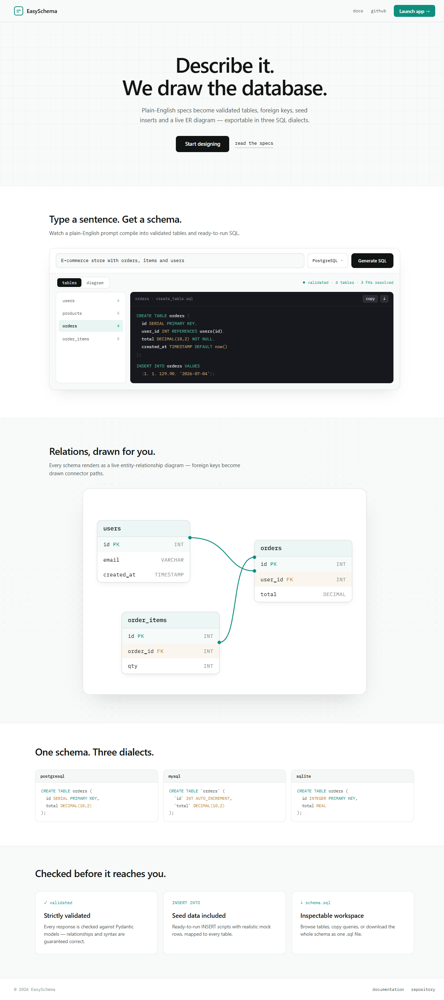
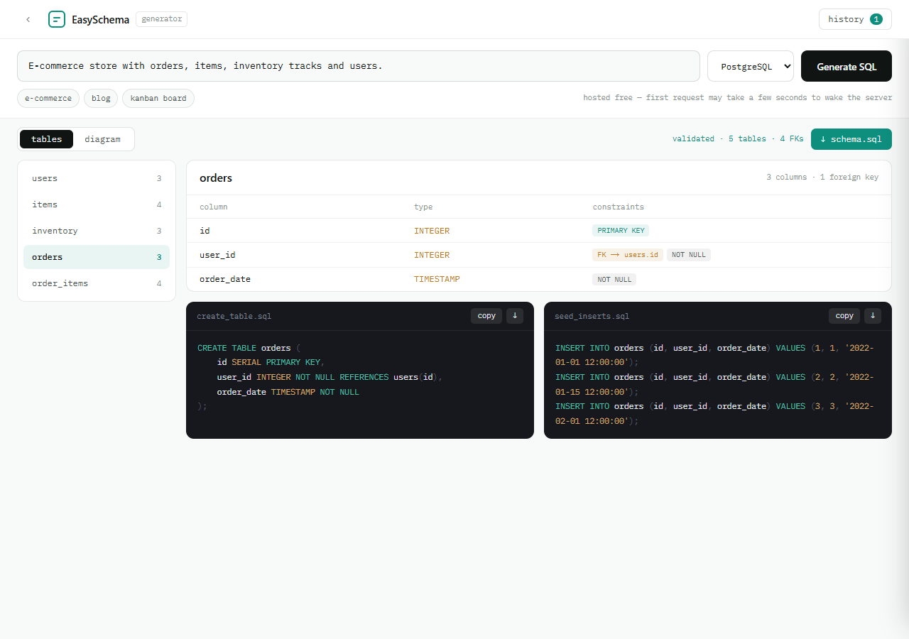
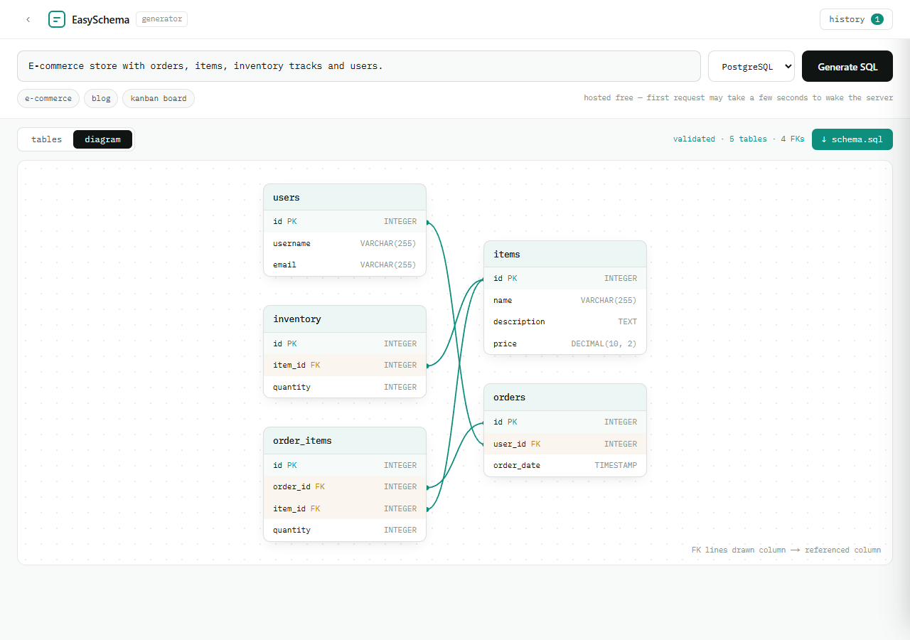

<div align="center">

  

  # EasySchema

  **From natural language to production-ready SQL schemas in seconds.**

  [](https://github.com/sohaibirfann/easyschema/actions/workflows/ci.yml)
  [](https://fastapi.tiangolo.com)
  [](https://nextjs.org)
  [](https://www.typescriptlang.org)
  [](https://tailwindcss.com)
  [](https://docs.pydantic.dev)
  [](LICENSE)

  [**Live demo**](https://easyschema.vercel.app) • [Overview](#overview) • [Screenshots](#screenshots) • [Architecture](#architecture) • [Getting started](#getting-started) • [Features](#features)

  > Hosted on free tiers — the backend spins down when idle, so the first request after a while may take up to ~30s to wake up. The UI tells you when this is happening instead of just looking stuck.

</div>

## Overview

EasySchema is a full-stack application that translates plain English descriptions of database structures into complete, executable SQL — `CREATE TABLE` DDL, `INSERT` seed DML, and a live entity-relationship diagram — powered by Groq's LLM, enforced through Pydantic schema validation, and compiled deterministically into **PostgreSQL, MySQL, or SQLite** syntax.

> [!TIP]
> You don't need any database setup to use EasySchema. Just describe what you want and copy the generated SQL.

## Screenshots

**Landing page**



**Generator — Tables view**, with syntax-highlighted DDL and seed-insert panels



**Generator — Diagram view**, foreign keys drawn as connectors between tables



## Architecture

```
easyschema/
├── backend/                       # FastAPI server
│   ├── main.py                    # Entry point, CORS allowlist
│   ├── routers/schema.py          # GET /api/health, POST /api/generate (rate-limited)
│   ├── models/schema.py           # Pydantic models (columns, FK references, dialect)
│   ├── services/
│   │   ├── ai_service.py          # Async Groq caller, retries transient failures
│   │   └── sql_generator.py       # Validation + dialect-aware DDL/DML compiler
│   ├── requirements.txt
│   └── test_service.py            # pytest suite
│
├── frontend/                      # Next.js App Router
│   └── src/
│       ├── app/
│       │   ├── page.tsx               # Landing page
│       │   ├── layout.tsx             # Root layout (Space Grotesk, IBM Plex Mono)
│       │   ├── globals.css            # Tailwind theme + design tokens
│       │   ├── icon.svg               # Favicon / brand mark
│       │   └── generator/page.tsx     # Workspace (thin composition of components below)
│       ├── components/
│       │   ├── PromptForm.tsx         # Prompt textarea, dialect select, presets
│       │   ├── TablesView.tsx         # Sidebar + columns table + DDL/seed SQL panels
│       │   ├── SchemaDiagram.tsx      # ER diagram with drawn FK connectors
│       │   ├── HistoryDrawer.tsx      # Slide-in schema history (localStorage)
│       │   ├── ResultStates.tsx       # Empty / loading / waking-up / error states
│       │   ├── SqlHighlight.tsx       # Hand-rolled SQL syntax highlighter
│       │   ├── BrandMark.tsx          # Logo glyph
│       │   └── WarmUpPing.tsx         # Fire-and-forget health ping on mount
│       └── types/schema.ts            # Shared TS types (Column, TableSchema, Dialect...)
│
├── .github/workflows/
│   ├── ci.yml                     # pytest + tsc + fallow on push/PR
│   └── keep-warm.yml              # pings /api/health every 10 min
│
└── docs/screenshots/              # README images
```

### How it works

1. You type a schema description in natural language (e.g. *"E-commerce store with orders, items, inventory and users"*) and pick a target SQL dialect
2. The frontend sends it to `POST /api/generate`
3. The backend calls Groq's `llama-3.3-70b-versatile` model with strict JSON mode, enforcing the Pydantic schema — including foreign-key references, auto-increment flags, and realistic seed rows
4. The backend rejects malformed results (duplicate table/column names) before compiling the response
5. Dialect-specific syntax (`SERIAL` vs `AUTO_INCREMENT` vs `INTEGER PRIMARY KEY AUTOINCREMENT`, etc.) is generated **deterministically** in `sql_generator.py` — the LLM's output stays dialect-neutral, so getting the SQL right doesn't depend on the model getting dialect trivia right
6. The frontend renders columns in a metadata table, SQL in syntax-highlighted copyable/downloadable panels, and foreign keys as a live ER diagram with drawn connector lines

## Getting started

### Prerequisites

- Python 3.11+
- Node.js 20+
- A [Groq API key](https://console.groq.com/keys)

### Backend

```bash
cd backend
python -m venv .venv
.venv\Scripts\activate       # Windows
# source .venv/bin/activate  # macOS/Linux
pip install -r requirements.txt

# Create .env with your API key
cp .env.example .env
# Edit .env: GROQ_API_KEY=your_key_here

uvicorn main:app --port 8000
```

Run the test suite with `pytest`.

### Frontend

```bash
cd frontend
npm install
npm run dev
```

Open [http://localhost:3000](http://localhost:3000) in your browser. The dev proxy in `next.config.ts` routes `/api/*` requests to the backend (`BACKEND_URL` env var, defaults to `http://localhost:8000`).

## Features

- **Natural language to SQL** — Describe your schema in plain English, get valid `CREATE TABLE` and `INSERT` statements
- **Multi-dialect compiler** — Generate the same schema as PostgreSQL, MySQL, or SQLite; dialect-specific syntax is rendered deterministically, not left to the LLM
- **Live ER diagram** — Every generated schema renders as an entity-relationship diagram, with foreign keys drawn as connector lines between the referencing and referenced columns
- **Pydantic-enforced output** — The AI response is validated against a strict schema, with an additional guard rejecting duplicate table/column names before any SQL is generated
- **Resilient to API hiccups** — Transient Groq failures (rate limits, 5xx) are retried automatically with backoff
- **Structured column viewer** — Per-table breakdown of columns, types, and constraints, with foreign keys and primary keys visually tagged
- **Syntax-highlighted SQL panels** — Copy DDL or seed DML to clipboard, or download individual files or the whole schema as one `.sql`
- **Schema history** — A slide-in drawer stores up to 20 previous generations in local storage, with relative timestamps, table counts, and one-click restore
- **3 preset prompts** — Quick-start buttons for common schema types (e-commerce, blog, project board)
- **Honest cold-start UX** — Hosted on free tiers; a dedicated "waking the server" state (not a spinner that just hangs) covers the first request after the backend has been idle
- **Rate-limited API** — IP-based limiting on `/api/generate` protects the shared Groq key from abuse
